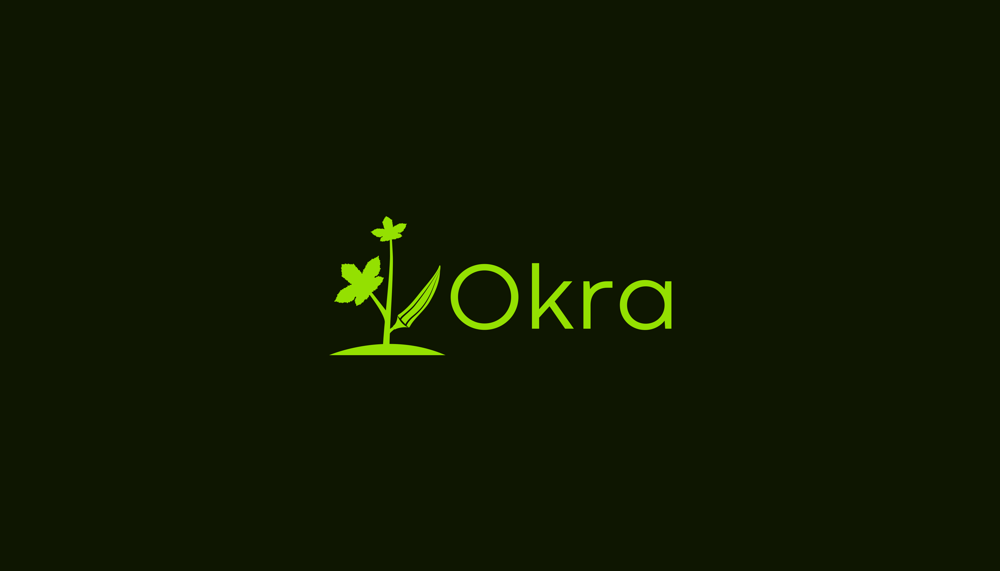

<h2 align="center"><i>A Simple Yet Extensible Scripting Language</i></h2>

### Intro
Okra is an interpreted, high-level, general-purpose programming language designed to make scripting easy and maintainable. Taking inspiration from the likes of Python, JavaScript, and Go, Okra emphasizes readability through a digestible syntax. Although largely procedural, Okra supports an object-oriented paradigm by means of structs, interfaces, and struct embedding. While Okra may not be "batteries included" like Python, an extensive standard library to cover basic file I/O, mathematics, and key data structures and algorithms is accessible from the get-go. To promote consistency across the language's community, a built-in formatter akin to `go fmt` is included.

<i>Please note that the contents of this repository were designed and implemented solely for educational purposes. The Okra development team has no intentions of monetization or commercialization and exists solely to reinforce the value of open source software and its community.</i>

### Playground
To test out the language, visit [the official Okra playground](https://repl.it) as hosted on Repl.it! Please note that due to size and dependency restrictions, all language features may not be supported. We've include sample files, which are the same as those noted in the [tutorial](www.google.com), for your reference.

Playground version: <b><i>1.0.0</i></b>


## Table of Contents
- [Installation](#Installation)
- [Usage](#Usage)
- [Updates](#Updates)
- [Contributing](#Contributing)
- [Credits](#Credits)
- [License](#License)


## Installation


### Dependencies


## Usage


### Writing Scripts
To learn more about Okra's syntax and the language's features, please see our dedicated [tutorial](www.google.com). We've included code snippets therein but we highly recommend testing and breaking the sample files on your own machine or [the playground](https://repl.it).


### Running Executable
Upon building the executable and setting up your path, there are two ways in which you can utilize the `okra` command:

```
// Run the interpreter on a script
okra run [script]


// Run the formatter on a script or directory
okra fmt [script/dir]
```

Okra strongly encourages usage of the native formatting rules to ensure consistency between file and codebases. However, if you would like to modify the standard rules, please update `rules.json` in `okra/formatter` before creating the executable. Directions on how to adjust format parameters are included therein.

<i>Please note that both commands will only work on files with a `.okr` extension. The formatter will ignore invalid files if used on a directory.</i>


## Updates
### Releases
- 1.0.0: Initial release (TBD)
### Roadmap
##### High Priority:
##### Low Priority:


## Contributing
Although Okra was designed as an educational project, any contributions or suggestions are greatly appreciated! If you would like to contribute to the codebase, please follow these steps:

```
1. Create an issue 
2. Fork the repo
3. Create a branch*
4. Make your changes
5. Write unit tests as applicable; as a rule of thumb, ensure that the test suite has coverage over your changes
6. Format the codebase using `go fmt`**
7. Ensure that your changes passes all tests using `go test`**
8. Squash your changes to as few commits as possible*
9. Make a pull request*
```
<i>*Please use the issue number and name when possible to improve clarity and project maintainability (i.e. "134-AddTernaryOperator")<br></i>
<i>**Failure to run commands can cause changes to be rejected by Travis so please double check your work.</i>


## Credits
This project would not have have been possible without the following resources: 
- [Crafting Interpreters](https://craftinginterpreters.com/) by Bob Nystrom and the Lox language discussed therein
- [Structure and Interpretation of Computer Programs](https://mitpress.mit.edu/sites/default/files/sicp/full-text/book/book.html) by Gerald Jay Sussman and Hal Abelson and the rest of the team behind [MIT 6.001](https://ocw.mit.edu/courses/electrical-engineering-and-computer-science/6-001-structure-and-interpretation-of-computer-programs-spring-2005/)
- Alex Gaynor's [PyCon 2013 talk](https://www.youtube.com/watch?v=LCslqgM48D4) on writing interpreters
- [Composing Programs](https://composingprograms.com/) by John DeNero


## License
The Okra project is licensed under the MIT License Copyright (c) 2020.

See the [LICENSE](https://github.com/cdkini/Okra/blob/master/LICENSE) for information on the history of this software, terms & conditions for usage, and a DISCLAIMER OF ALL WARRANTIES.

All trademarks referenced herein are property of their respective holders.
